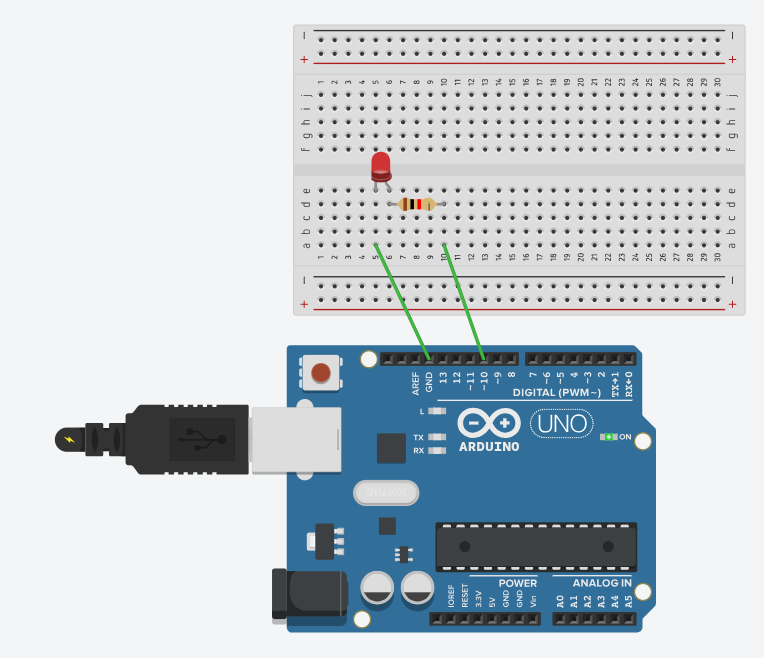

# 💡 Ponderada de Programação - Semana 1 (Módulo 4 - IoT)

Este repositório contém a entrega da **Ponderada de Programação - Semana 1** do Módulo 4 do Inteli.  
O objetivo foi realizar as primeiras interações com a **placa Arduino UNO**, desenvolvendo um código básico em **C/C++** para fazer um LED piscar (blink), além de montar e testar um circuito externo no **Tinkercad** e em um **protoboard físico**.

---

## Parte 1: Blink Interno

Nesta etapa, realizamos a instalação da **Arduino IDE** e programamos o LED interno da placa (pino 13) para piscar com um intervalo definido.

### 📌 Código Utilizado

```cpp
void setup() {
  pinMode(13, OUTPUT);
}

void loop() {
  digitalWrite(13, HIGH);
  delay(500);
  digitalWrite(13, LOW);
  delay(500);
}
```

### 📸 Evidências:

<div align="center">
   <sub>Imagem 1: Screenshot do código na IDE</sub><br>
   <br>
   <sup>Fonte: Autoral (2025)</sup>
 </div>

<div align="center">
   <sub>GIF 1: Arduino com LED interno aceso</sub><br>
   <br>
   <sup>Fonte: Autoral (2025)</sup>
 </div>

--- 

## Parte 2.1 - Simulação no Tinkercad

Nesta etapa, foi feita uma montagem com protoboard, LED externo, resistor de 220 Ω e a placa Arduino UNO, simulada no Tinkercad.
O circuito foi programado para fazer o LED piscar em uma determinada cadência.

### 📌 Código

```cpp
void setup() {
  pinMode(10, OUTPUT);
}

void loop() {
  digitalWrite(10, HIGH);
  delay(500);
  digitalWrite(10, LOW);
  delay(500);
}
```

🔗 Simulação no Tinkercad: [Clique aqui!](https://www.tinkercad.com/things/jXgsw5Ai4tB/editel?returnTo=%2Fdashboard%2Fdesigns%2Fcircuits&sharecode=XDBPTA-cLFCUuB0cOzntJTm-gC7qWh8yq-9_7uSLEqU)

### 📸 Evidências:

<div align="center">
   <sub>Imagem 2: Imagem da montagem no Tinkercad</sub><br>
   <br>
   <sup>Fonte: Autoral (2025)</sup>
 </div>

- Código exportado: 📥 [Baixar o arquivo da placa (.brd)](assets/placa.brd)

## Parte 2.2 - Montagem física no Protoboard

Por fim, o circuito também foi montado fisicamente em um protoboard real, com a mesma configuração usada na simulação.
Foram utilizados:

- 1 LED
- 1 resistor de 220 Ω
- 1 Arduino UNO
- Jumpers para conexões com pino digital 10 e GND

<div align="center">
   <sub>GIF 2: LED piscando conectado ao Arduino</sub><br>
   <br>
   <sup>Fonte: Autoral (2025)</sup>
 </div>