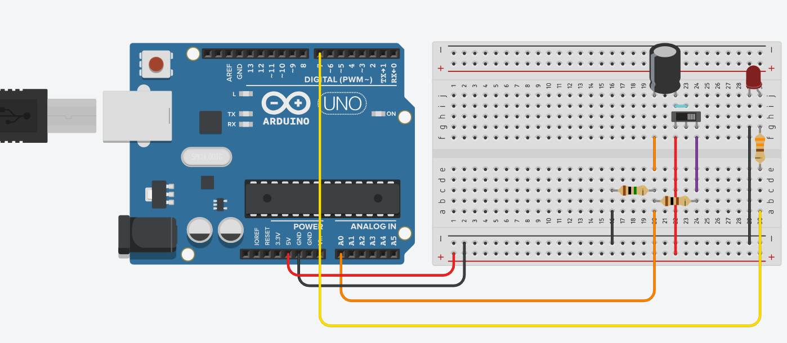
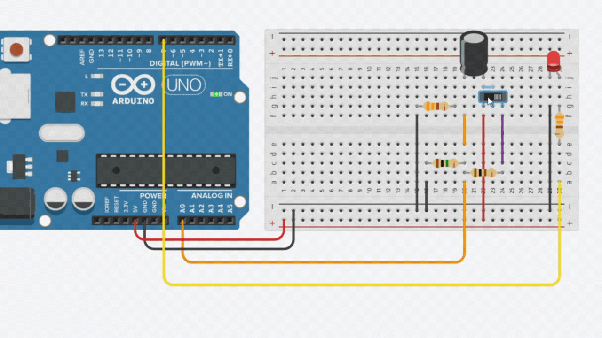
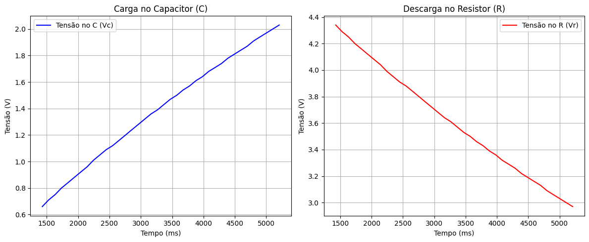

# ⚡ Ponderada de Programação – Semana 2 - Circuito RC (Módulo 4 – IoT)

Este repositório contém a entrega referente ao estudo do comportamento de carga e descarga em um circuito RC (Resistor + Capacitor), utilizando a placa Arduino UNO.
O objetivo foi **coletar e analisar dados** experimentais de tensão no resistor e no capacitor durante o processo de **carga e descarga**, simulando e registrando o comportamento via **Tinkercad e Serial Plotter**.

--- 

## Parte 1 – Montagem do Circuito RC

O circuito RC foi montado utilizando um resistor, um capacitor eletrolítico, e um LED conectado ao Arduino UNO para observação visual do processo de carga e descarga.

### 🧩 Componentes utilizados

- 1 Arduino UNO
- 3 Resistores
- 1 Capacitor eletrolítico
- 1 Switch deslizante
- 1 LED
- Jumpers e Protoboard

O circuito permite observar a carga e descarga do capacitor, controlada pelo switch.
O LED foi conectado ao pino digital 7 para indicar visualmente a variação da tensão, diminuindo o brilho conforme a carga diminui.

### 📌 Código do Arduino

```cpp
int pinoNoRC = A0;
int led = 9; 
int valorLido = 0;
float tensaoCapacitor = 0, tensaoResistor;
unsigned long tempo;

void setup() { 
  Serial.begin(9600); 
  pinMode(led, OUTPUT);
} 

void loop() { 
  tempo = millis(); 
  valorLido = analogRead(pinoNoRC); 
  tensaoResistor = (valorLido * 5.0 / 1023.0);
  tensaoCapacitor = abs(5.0 - tensaoResistor);
  Serial.print(tempo); 
  Serial.print(" "); 
  Serial.print(tensaoResistor, 3);
  Serial.print(" ");
  Serial.println(tensaoCapacitor, 3); 
  int brilho = map(valorLido, 0, 1023, 0, 255);
  analogWrite(led, brilho);
  delay(1000);
}
```

### 📸 Evidência de Montagem:
<div align="center">
   <sub>Imagem 1: Screenshot da montagem no Tinkercad</sub><br>
   <br>
   <sup>Fonte: Autoral (2025)</sup>
 </div>

<div align="center">
   <sub>GIF 1: Montagem no Tinkercad</sub><br>
   <br>
   <sup>Fonte: Autoral (2025)</sup>
 </div>

🔗 Simulação no Tinkercad: [Clique aqui!](https://www.tinkercad.com/things/eUjPY4Hfseq/editel?returnTo=%2Fdashboard%2Fdesigns%2Fcircuits&sharecode=_S8XFS80mievt-Fn6yFKwAWWeqq8M5GKtKuJabnFL7U)

---

## 📊 Parte 2 - Coleta de Dados e Análise Gráfica

Após a simulação, os valores de tensão no resistor (Vr) e no capacitor (Vc) foram coletados via Monitor Serial do Tinkercad.
Esses dados foram exportados para o Python, onde foram processados e plotados em gráficos de carga e descarga.

### 📌 Código Python Utilizado
```
import matplotlib.pyplot as plt
import numpy as np

dados = """
1428 4.34 0.66
1529 4.29 0.71
1632 4.25 0.75
1734 4.20 0.80
1837 4.16 0.84
1938 4.12 0.88
2040 4.08 0.92
2143 4.04 0.96
2245 3.99 1.01
2347 3.95 1.05
2449 3.91 1.09
2551 3.88 1.12
2654 3.84 1.16
2756 3.80 1.20
2857 3.76 1.24
2960 3.72 1.28
3062 3.68 1.32
3165 3.64 1.36
3266 3.61 1.39
3368 3.57 1.43
3471 3.53 1.47
3573 3.50 1.50
3675 3.46 1.54
3777 3.43 1.57
3879 3.39 1.61
3982 3.36 1.64
4083 3.32 1.68
4186 3.29 1.71
4288 3.26 1.74
4390 3.22 1.78
4492 3.19 1.81
4594 3.16 1.84
4697 3.13 1.87
4799 3.09 1.91
4900 3.06 1.94
5003 3.03 1.97
5105 3.00 2.00
5208 2.97 2.03
"""

linhas = [l.strip() for l in dados.splitlines() if l.strip()]
tempo, Vr, Vc = zip(*[map(float, l.split()) for l in linhas])

fig, (ax1, ax2) = plt.subplots(1, 2, figsize=(12, 5))

ax1.plot(tempo, Vc, color='blue', label='Tensão no C (Vc)')
ax1.set_title('Carga no Capacitor (C)')
ax1.set_xlabel('Tempo (ms)')
ax1.set_ylabel('Tensão (V)')
ax1.grid(True)
ax1.legend()

ax2.plot(tempo, Vr, color='red', label='Tensão no R (Vr)')
ax2.set_title('Descarga no Resistor (R)')
ax2.set_xlabel('Tempo (ms)')
ax2.set_ylabel('Tensão (V)')
ax2.grid(True)
ax2.legend()

plt.tight_layout()
plt.show()
```

### 📈 Resultados Obtidos

Os gráficos a seguir mostram o comportamento típico de um circuito RC:

- Durante a carga, a tensão no capacitor (Vc) aumenta, enquanto a tensão no resistor (Vr).

<div align="center">
   <sub>Imagem 2: Gráficos da carga e descarga do circuito RC</sub><br>
   <br>
   <sup>Fonte: Autoral (2025)</sup>
 </div>

--- 

## ⚙️ Conclusão

O experimento permitiu compreender, de forma prática, o comportamento dinâmico de um circuito RC, uma das bases dos sistemas analógicos e digitais em IoT.
O uso do Arduino UNO como coletor de dados e o Python como ferramenta de visualização mostraram como a integração entre hardware e software pode ser usada para monitoramento e análise de fenômenos elétricos em tempo real.