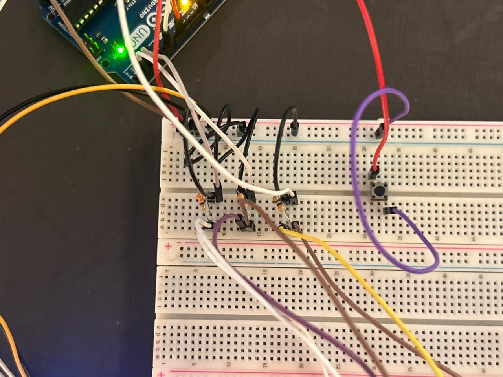
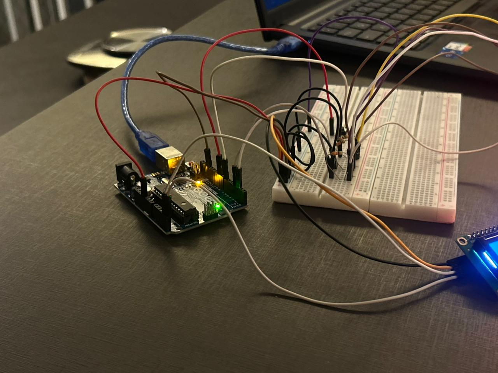
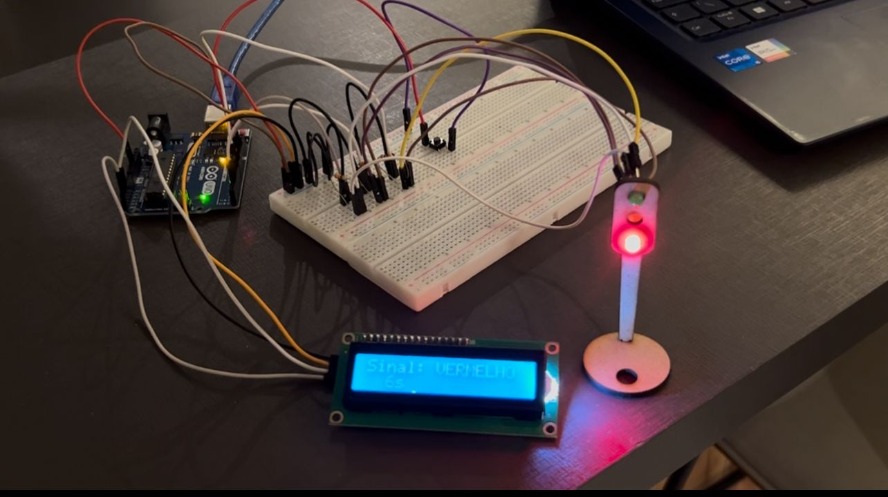

# 🚦 Ponderada de Programação - Semana 2 (Módulo 4 - IoT)

Este repositório contém a entrega da Ponderada de Programação - Semana 3 do Módulo 4 do Inteli.
O objetivo foi desenvolver um semáforo inteligente com Arduino UNO, simulando o controle de fluxo de veículos e pedestres em um cruzamento real, aplicando lógica de tempo, programação orientada a objetos e uso de display LCD.

## 🧠 Contexto da Atividade

Durante o estágio no Departamento de Engenharia de Trânsito, foi proposto o desafio de controlar o fluxo em uma via movimentada do bairro Butantã.
A tarefa consistiu em montar e programar um semáforo funcional que garantisse segurança e eficiência, alternando entre as cores vermelho, verde e amarelo, com tempos definidos e controle adicional via botão, simulando o aumento de fluxo de veículos.
--- 

## Parte 1 - Montagem Física do Semáforo
A montagem foi realizada em uma protoboard com os seguintes componentes:
| Componente             | Quantidade | Função                                 | Pino no Arduino    | Observações                         |
| ---------------------- | ---------- | -------------------------------------- | ------------------ | ----------------------------------- |
| LED Vermelho           | 1          | Representa o sinal de “PARE”           | D7                 | Protegido por resistor de 220 Ω     |
| LED Amarelo            | 1          | Representa o sinal de “ATENÇÃO”        | D2                 | Protegido por resistor de 220 Ω     |
| LED Verde              | 1          | Representa o sinal de “SIGA”           | D3                 | Protegido por resistor de 220 Ω     |
| Resistores             | 3          | Limitam a corrente dos LEDs            | —                  | 220 Ω cada                          |
| Botão (push button)    | 1          | Simula aumento de fluxo de veículos    | D9                 | Configurado com `INPUT_PULLUP`      |
| Display LCD 16x2 (I2C) | 1          | Mostra o estado e o tempo de cada fase | SDA (A4), SCL (A5) | Endereço: 0x27                      |
| Arduino UNO R3         | 1          | Microcontrolador principal             | —                  | Alimenta e controla todo o circuito |
| Protoboard + Jumpers   | —          | Estrutura e conexões                   | —                  | Fios organizados e coloridos        |

## Parte 2 - Lógica e Programação
O código foi desenvolvido em C++ utilizando:

- Programação Orientada a Objetos (POO): a classe Led encapsula o comportamento de acender/apagar e exibir no LCD.
- Ponteiros (int*): usados para alterar dinamicamente o tempo de cada cor (verde aumenta quando o botão é pressionado).
- LCD I2C: exibe a cor atual e o tempo restante de forma interativa.
- Botão com INPUT_PULLUP: detecta o aumento de fluxo sem ruído elétrico.

### 📌 Código utilizado

```cpp
// importa bibliotecas necessárias
#include <Wire.h>
#include <LiquidCrystal_I2C.h>

// setup do LCD 
LiquidCrystal_I2C lcd(0x27, 16, 2);

// variáveis para os pinos conectados no arduino
int ledVerde = 3;
int ledAmarelo = 2;
int ledVermelho = 7;
int botao = 9;
bool fluxoAlto = false;

// setup das entradas do arduino
void setup() {
  lcd.init();
  lcd.backlight();

  Serial.begin(9600);

  pinMode(ledVerde, OUTPUT);
  pinMode(ledAmarelo, OUTPUT);
  pinMode(ledVermelho, OUTPUT);
  pinMode(botao, INPUT_PULLUP); 
}

// criação da classe Led, que tem como métodos acender, apagar e mostrarComTempo
class Led {
  int porta_;
  bool estado_;
public:
  Led(int porta) : porta_(porta), estado_(false) {}

  void acender() {
    if (!estado_) {
      estado_ = true;
      digitalWrite(porta_, HIGH);
    }
  }

  void apagar() {
    if (estado_) {
      estado_ = false;
      digitalWrite(porta_, LOW);
    }
  }

  void mostrarComTempo(int* tempoPtr, const char* cor, const char* mensagem) {
    acender();
    for (int t = *tempoPtr; t > 0; t--) {
      lcd.clear();
      lcd.setCursor(0, 0);
      lcd.print("Sinal: ");
      lcd.print(cor);
      lcd.setCursor(0, 1);
      lcd.print(mensagem);
      lcd.print(" ");
      lcd.print(t);
      lcd.print("s");
      delay(1000);
    }
    apagar();
  }
};

// criação dos objetos da classe Led
Led vermelho(7);
Led amarelo(2);
Led verde(3);

void loop() {
  // inicializa as variáveis de tempo padrão para cada cor do semáforo
  int tempoVermelho = 6;
  int tempoVerde = 4;
  int tempoAmarelo = 2;

  // cria ponteiros para as variáveis de tempo
  int* ptrVermelho = &tempoVermelho;
  int* ptrVerde = &tempoVerde;
  int* ptrAmarelo = &tempoAmarelo;

  // verifica se o botão foi pressionado
  if (digitalRead(botao) == LOW) {
    // se o botão foi pressionado, aumenta o tempo do sinal verde
    *ptrVerde = 8;
    lcd.clear();
    // exibe mensagem de fluxo alto e tempo de verde alterado
    lcd.setCursor(0, 0);
    lcd.print("Fluxo alto!");
    lcd.setCursor(0, 1);
    lcd.print("Verde = 8s");
    // pequeno atraso para a mensagem ser lida
    delay(1500);
  } else {
    // se o botão não foi pressionado, mantém o tempo padrão para o sinal verde
    *ptrVerde = 4;
  }

  // aciona o sinal VERMELHO, mostrando a mensagem e contagem regressiva no LCD
  vermelho.mostrarComTempo(ptrVermelho, "VERMELHO", "PARE");
  // aciona o sinal VERDE, mostrando a mensagem e contagem regressiva no LCD
  verde.mostrarComTempo(ptrVerde, "VERDE", "SIGA");
  // aciona o sinal AMARELO, mostrando a mensagem e contagem regressiva no LCD
  amarelo.mostrarComTempo(ptrAmarelo, "AMARELO", "ATENCAO");
}
```

### 🧩 Funcionamento do Sistema
- O sinal vermelho permanece ativo por 6 segundos, exibindo “PARE” no LCD.
- O sinal verde fica ativo por 4 segundos, ou 8 segundos se o botão for pressionado (simulando aumento de fluxo).
- O sinal amarelo é exibido por 2 segundos, alertando para a troca de fase.
- Todo o ciclo se repete indefinidamente.

💡 O uso de ponteiros permite alterar o tempo de execução em tempo real, sem reiniciar o programa.
💡 O LCD 16x2 exibe dinamicamente as informações, tornando o sistema mais interativo e visual.

### 📸 Evidências Visuais

<div align="center">
   <sub>Imagem 1: Fios</sub><br>
   <br>
   <sup>Fonte: Autoral (2025)</sup>
 </div>

<div align="center">
   <sub>Imagem 2: Montagem na protoboard</sub><br>
   <br>
   <sup>Fonte: Autoral (2025)</sup>
 </div>

<div align="center">
   <sub>Imagem 3: Semáforo offline completo</sub><br>
   <br>
   <sup>Fonte: Autoral (2025)</sup>
 </div>

📽️ Vídeo de demonstração: https://youtu.be/2aXekwZtBkg
---

## 🧠 Conclusão
O projeto Semáforo Inteligente representa um passo importante na aplicação prática dos conceitos de IoT, eletrônica básica e programação C++.
Ele demonstra o controle automatizado de fluxo com feedback visual e interativo, além de integrar conceitos como POO, ponteiros e entrada digital em um sistema simples e funcional.