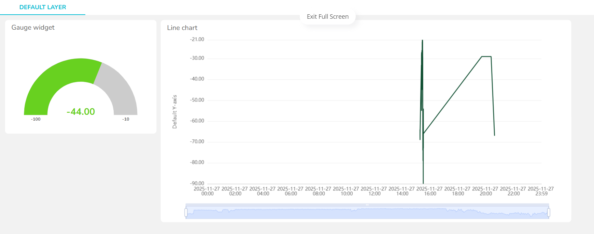
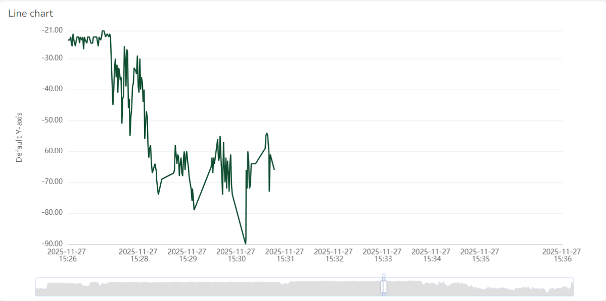

# 💡 Ponderada de Programação - Semana 7 (Módulo 4 - IoT)
## 📡 Monitoramento de Intensidade de Sinal Wi-Fi (RSSI) com ESP32 e Ubidots  

Este projeto teve como objetivo desenvolver um sistema IoT capaz de **medir continuamente a intensidade do sinal Wi-Fi (RSSI, em dBm)** utilizando um **ESP32**, transmitindo os valores coletados para a plataforma **Ubidots** via **MQTT** e exibindo esses dados em uma dashboard em tempo real. O experimento foi finalizado com uma demonstração prática no elevador do Inteli, simulando o efeito de uma **gaiola de Faraday** e registrando a queda abrupta do sinal.

---

## 🧠 Desenvolvimento do Sistema

A construção do código partiu da combinação de duas fontes oficiais. Para medir o RSSI, foi utilizado o exemplo publicado pelo **Random Nerd Tutorials**, que apresenta um conjunto de funções úteis para Wi-Fi no ESP32. O trecho central responsável pela leitura do nível de sinal veio deste tutorial:  
🔗 *https://randomnerdtutorials.com/esp32-useful-wi-fi-functions-arduino/#5*

Já a parte responsável pela conexão MQTT e envio dos dados para a Ubidots foi extraída do **exemplo oficial de publish** presente na própria biblioteca *UbidotsEsp32Mqtt* da Arduino IDE. Essa base fornece os métodos corretos para autenticação, publicação de variáveis e manutenção da conexão MQTT.

Após analisar ambas as implementações, realizei a fusão dos dois códigos, integração necessária para que o ESP32 pudesse simultaneamente medir o RSSI, exibir o valor na serial e enviá-lo para a nuvem com a frequência desejada. Essa junção permitiu criar um sistema contínuo de coleta e transmissão, com reconexão automática e atualização em intervalo de 1 segundo.

---

## ⚙️ Código Final Utilizado

```cpp

#include <WiFi.h>
#include "UbidotsEsp32Mqtt.h"

// configurações
const char *UBIDOTS_TOKEN   = "SEU_TOKEN"; //foi inserido o meu token do ubidots aqui
const char *WIFI_SSID       = "Inteli.Iot";
const char *WIFI_PASS       = "SENHA"; // aqui, a senha do wifi
const char *DEVICE_LABEL    = "esp32-rssi";
const char *VARIABLE_LABEL  = "rssi";
const int PUBLISH_FREQUENCY = 1000;

unsigned long timer;

Ubidots ubidots(UBIDOTS_TOKEN); // instancia a classe Ubidots

// callback que não é usado, mas necessário
void callback(char *topic, byte *payload, unsigned int length) {}

void setup() {
  Serial.begin(115200);
  ubidots.connectToWifi(WIFI_SSID, WIFI_PASS); // conecta ao wifi
  ubidots.setCallback(callback);
  ubidots.setup(); // inicializa o MQTT
  ubidots.reconnect(); // conecta ao broker
  timer = millis();
}

void loop() {
  if (!ubidots.connected()) {
    ubidots.reconnect();
  }

  // envia dados a cada intervalo definido
  if ((millis() - timer) > PUBLISH_FREQUENCY) {
    long rssiValue = WiFi.RSSI();
    Serial.print("RSSI (dBm): ");
    Serial.println(rssiValue);

    // publica no ubidots
    ubidots.add(VARIABLE_LABEL, rssiValue); 
    ubidots.publish(DEVICE_LABEL);
    timer = millis();
  }
  ubidots.loop();
}

```

## 📊 Dashboard e Monitoramento em Tempo Real

Com o dispositivo transmitindo os valores de RSSI para a Ubidots, foi criada uma dashboard contendo dois elementos importantes: um gauge para visualização instantânea da intensidade do sinal, e um gráfico de linha (line chart) para análise temporal mais detalhada.

A gauge fornece uma leitura imediata da força do sinal, facilitando a interpretação visual, enquanto o gráfico demonstra a flutuação ao longo do tempo e permite identificar padrões de queda e recuperação.

<div align="center">
   <sub>Imagem 1: Dashboard no Ubidots</sub><br>
   <br>
   <sup>Fonte: Autoral (2025)</sup>
 </div>

Esses gráficos foram essenciais para observar o comportamento dinâmico do sinal durante os testes.

---

## 🛗 Experimento no Elevador — Simulação de Gaiola de Faraday

Para validar a resiliência da comunicação e observar o impacto de barreiras físicas no sinal, realizei um teste entrando com o ESP32 ligado dentro do elevador do Inteli. Ambientes como elevadores geralmente são compostos por estruturas metálicas que funcionam como gaiolas de Faraday, bloqueando ondas eletromagnéticas, inclusive Wi-Fi.

Durante o experimento, foi possível observar três comportamentos principais:

1. **Queda rápida do RSSI** à medida que me aproximava do elevador.  
2. **Perda quase total de sinal** ao entrar, registrada na dashboard como valores extremamente negativos ou ausência temporária de dados.  
3. **Retorno progressivo da conexão** ao sair do elevador, com o ESP32 voltando a publicar normalmente.

A variação capturada pela dashboard demonstra claramente a atenuação do sinal e comprova os efeitos de blindagem em radiofrequência.

<div align="center">
   <sub>Imagem 2: Gráfico tempo × dBm</sub><br>
   <br>
   <sup>Fonte: Autoral (2025)</sup>
 </div>

---

### 🎥 Vídeo da Experiência

Inclui: 
- Sistema em funcionamento  
- Dashboard atualizando em tempo real  
- Entrada e saída do elevador  
- Evidência clara do comportamento do sinal  

🔗 [Google Drive - Vídeo da Gaiola de Faraday](https://drive.google.com/file/d/1p5y_RqJEmZWj8AWODqJxCaRIPJQZapFA/view?usp=drivesdk)

---

## 🧠 Conclusão

Este projeto possibilitou vivenciar um ciclo IoT completo, passando pela leitura de sensores, conexão Wi-Fi, envio de dados via MQTT, visualização em plataforma de nuvem e realização de experimentos reais para análise do comportamento do sinal. A integração de duas bases de código, o exemplo de RSSI do Random Nerd Tutorials e o exemplo MQTT da biblioteca Ubidots, permitiu construir uma solução robusta, modular e adaptada ao objetivo da atividade.

Além de aplicar conhecimentos de eletrônica, redes sem fio e protocolos de comunicação, o experimento evidenciou fenômenos físicos importantes, como a atenuação do sinal em estruturas metálicas, reforçando a compreensão prática do impacto ambiental no funcionamento de sistemas IoT.